# Understanding the Workflows — A Beginner-Friendly Guide

This document explains **every GitHub Actions workflow** in `.github/workflows/` in plain, simple language — no prior DevOps experience needed. Each section covers: **what it does, when it runs, a step-by-step walkthrough, and a diagram.**

If you're brand new to GitHub Actions, read the [Quick Glossary](#-quick-glossary) at the end first — it explains words like "workflow", "job", "step", and "trigger" in one line each.

---

## 🗺️ The Big Picture

There are **16 workflow files**, and they fall into three groups:

| Group | Purpose | Workflows |
|---|---|---|
| 🧩 **Fundamentals** | Teach basic GitHub Actions concepts | `hello.yml`, `env_demo.yml`, `github_pages.yml`, `cicd_dummy.yml` |
| 🔁 **CI/CD building blocks** | Reusable pieces that do one job each (lint, build, deploy) | `lint_and_test.yml`, `docker.yml`, `cd.yml`, `ci.yml`, `cicd.yml` |
| 🔐 **DevSecOps (security)** | Add security checks at every stage of the pipeline | `secrets-scanning.yml`, `sonar_scan.yml`, `dependency_scan.yml`, `trivy_scans.yml`, `docker_push.yml`, `dast.yml`, `devsecops_pipleline.yml` |

Think of it like a school: the **fundamentals** workflows are single lessons, the **CI/CD** workflows are lessons stitched into a school day, and **DevSecOps** is the full timetable with a security guard checking every door along the way.

---

## 🧩 Fundamentals Workflows

### 1. `hello.yml` — "Hello World"

**In plain words:** This is the very first workflow anyone should read. It just says hello and prints the name of the repository. Nothing is built, tested, or deployed.

- **Trigger:** Manual only (`workflow_dispatch`) — someone has to click "Run workflow" on GitHub.
- **What happens:**
  1. Job `greet` runs and prints `"Hello Friends"`.
  2. Job `repo-name` waits for `greet` to finish (`needs: greet`), then prints the repository's name.

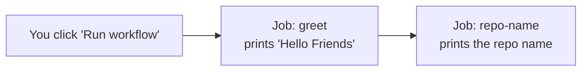

**Why it matters:** This teaches two core ideas — that a workflow can have multiple jobs, and that one job can wait for another using `needs:`.

---

### 2. `env_demo.yml` — Environment Variables, Secrets & Inputs

**In plain words:** This workflow is a demo shelf showing the four ways data can flow into a workflow: plain environment variables, GitHub **secrets** (hidden values like passwords), GitHub **variables** (non-secret shared values), and **manual inputs** you type in when starting the workflow.

- **Trigger:** Manual (`workflow_dispatch`), and it asks you to pick an environment (`dev`, `stg`, or `prd`) from a dropdown before it runs.
- **What happens (all in one job, `show_env`):**
  1. Prints a plain text variable (`NAME: Sumeet`) defined right in the file.
  2. Prints a **secret** (`TEXT_SECRET`) — GitHub automatically hides the real value in the logs.
  3. Prints a **repo variable** (`DOCKER_USERNAME`).
  4. Prints whatever environment you picked from the dropdown.

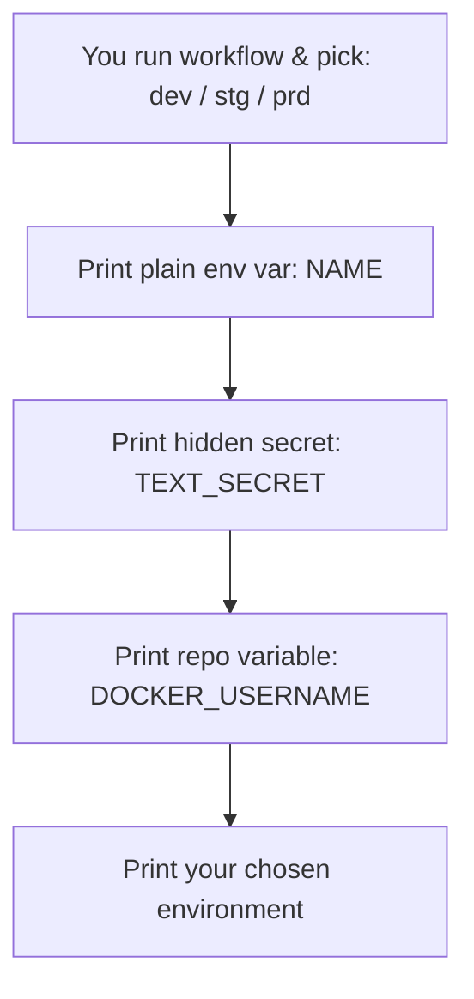

**Why it matters:** Real pipelines constantly need passwords, usernames, and configuration that changes per environment (dev vs. production). This shows the safe, built-in way to do that instead of hardcoding secrets in code.

---

### 3. `github_pages.yml` — Publish a Website for Free

**In plain words:** This takes the static files in this repo and publishes them as a live website using GitHub's free hosting (GitHub Pages).

- **Trigger:** Manual (`workflow_dispatch`).
- **What happens (job `deploy`):**
  1. Checks out the repo's code.
  2. Turns on GitHub Pages for this repository.
  3. Packages the current folder (`.`) as a "Pages artifact" (basically a zip GitHub understands).
  4. Publishes it — GitHub gives back a live URL.

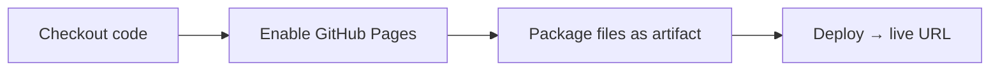

**Why it matters:** Not every deployment needs servers or Docker — GitHub Pages is a zero-infrastructure way to publish static content straight from a workflow.

---

### 4. `cicd_dummy.yml` — A Fake Pipeline (Training Wheels)

**In plain words:** This is a **pretend** CI/CD pipeline. It has all the *shape* of a real one — code, build, test, deploy — but every step just prints text (`echo`) instead of doing real work. It's a safe sandbox to see what a pipeline *looks* like before touching the real one.

- **Trigger:** Manual (`workflow_dispatch`).
- **What happens:**
  1. `code` — pretends to "clone the code" (checks it out).
  2. `build` — pretends to build using Docker Buildx (doesn't actually build an image).
  3. `test` — just echoes `"Test Passed"`.
  4. `deploy` — just echoes `"Application Deployed"`.
  Each job waits for the previous one (`needs:`).

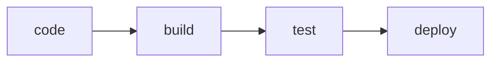

**Why it matters:** Great for beginners to understand pipeline *shape and ordering* without any risk of breaking something real.

---

## 🔁 CI/CD Building Blocks

These workflows are **reusable** — they use `on: workflow_call`, which means they don't run by themselves. Instead, another workflow "calls" them, the same way a function is called in code. This avoids repeating the same steps in multiple places.

### 5. `lint_and_test.yml` — Check the Code Quality

**In plain words:** Makes sure the Python code doesn't have obvious mistakes (linting) and that it actually works (testing) — and does this on three different versions of Python to be safe.

- **Trigger:** `workflow_call` only (called by other workflows, never runs on its own).
- **What happens (job `code-linter-and-test`, repeated for Python 3.12, 3.13, and 3.14 — a "matrix"):**
  1. Checkout the code.
  2. Install that specific Python version.
  3. Install dependencies from `requirements.txt`.
  4. Run `ruff check .` (the linter — flags messy or risky code).
  5. Run `pytest` (the tests — confirms the app actually behaves correctly).

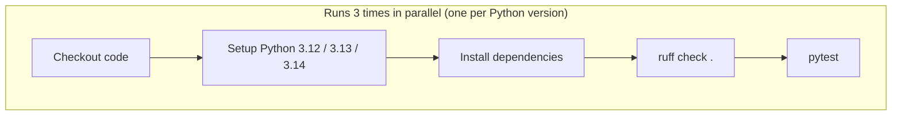

**Why it matters:** This is the very first safety net in any pipeline — if the code is broken or badly written, nothing downstream (build, deploy) should even be attempted.

---

### 6. `docker.yml` — Build & Push a Docker Image (Simple Version)

**In plain words:** Packages the app into a Docker image (a self-contained box with the app and everything it needs to run) and uploads it to Docker Hub, so it can be pulled and run anywhere.

- **Trigger:** `workflow_call` only.
- **What happens (job `build-and-push`):**
  1. Checkout code.
  2. Set up Docker.
  3. Log in to Docker Hub using stored credentials.
  4. Set up Docker Buildx (a more powerful builder engine).
  5. Build the image and push it to Docker Hub, tagged as `<username>/e-commerce-python:latest`.

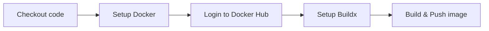

**Why it matters:** This is the "packaging" step — turning source code into a runnable artifact that can be shipped anywhere (a server, the cloud, a teammate's laptop).

---

### 7. `cd.yml` — Deploy to the Server

**In plain words:** Takes whatever image was pushed to Docker Hub and actually runs it on the target server (in this project, an EC2 instance acting as a "self-hosted runner").

- **Trigger:** `workflow_call` only.
- **Runs on:** `self-hosted` — **not** GitHub's cloud machines, but a machine *you* registered (here, the EC2 server itself). This matters because the deploy command needs to run directly on the server that will host the app.
- **What happens (job `deploy`):**
  1. Checkout the code (needed for `docker-compose.yml`).
  2. Run `docker compose up -d --build --force-recreate` — this pulls/builds the image and (re)starts the container, replacing whatever was running before.

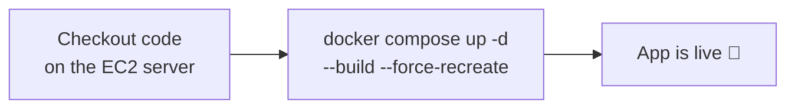

**Why it matters:** This is "the last mile" — getting the tested, packaged app actually running where real users can reach it.

---

### 8. `ci.yml` — Continuous Integration Only

**In plain words:** Runs the "make sure the code is good and build it" part of the pipeline, **without** deploying anywhere. Good for checking a change is safe before anyone decides to release it.

- **Trigger:** Manual (`workflow_dispatch`).
- **What happens:**
  1. `code-lint` → calls `lint_and_test.yml`.
  2. `build-and-push` → calls `docker.yml`, but only **after** `code-lint` succeeds.

```mermaid
flowchart LR
    A[code-lint\n(lint_and_test.yml)] --> B[build-and-push\n(docker.yml)]
```

---

### 9. `cicd.yml` — Continuous Integration **and** Deployment

**In plain words:** The full "real" pipeline (before the security checks were added) — lint & test, then build & push, then deploy — all triggered automatically whenever code is pushed.

- **Trigger:** `push` (runs automatically on every push to the repo).
- **What happens:**
  1. `code` → calls `lint_and_test.yml`.
  2. (build/deploy steps for this file are currently commented out in the code — see note below.)

```mermaid
flowchart LR
    A[push to repo] --> B[code\n(lint_and_test.yml)]
    B -.->|commented out| C[build-and-push\n(docker.yml)]
    C -.->|commented out| D[deploy\n(cd.yml)]
```

> **Note:** As currently written, `cicd.yml` only runs the lint/test stage — the build and deploy jobs are commented out in the file. The **fully active** end-to-end pipeline is `devsecops_pipleline.yml` (below).

---

## 🔐 DevSecOps (Security) Workflows

"DevSecOps" simply means **baking security checks into every stage of the pipeline**, instead of only checking for security problems at the very end (or not at all). Each workflow below checks for a *different kind* of risk.

### 10. `secrets-scanning.yml` — Catch Leaked Passwords & Keys

**In plain words:** Scans the entire history of the code (every past commit, not just the latest one) for anything that looks like a password, API key, or token that was accidentally committed. If someone accidentally pastes a real password into the code, this is what catches it.

- **Trigger:** `workflow_call` only.
- **What happens (job `secret-scan`):**
  1. Checkout the **full** git history (`fetch-depth: 0` — normally only the latest commit is pulled, but leaks could be hiding in old commits too).
  2. Run a secret-scanning tool (Gitleaks-style scanner) using the rules defined in [`.github/.gitleaks.toml`](.github/.gitleaks.toml).
  3. If leaks are found, the job is marked as failed (though `continue-on-error: true` lets the rest of the pipeline keep running so the team can see the full picture rather than being blocked immediately).

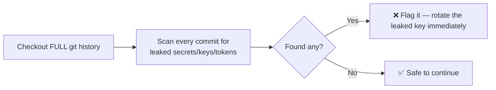

**Why it matters:** This is the very **first** gate in the DevSecOps pipeline — "shift-left" means catching problems as early as possible, and a leaked password is one of the most damaging things you can miss.

---

### 11. `sonar_scan.yml` — Static Application Security Testing (SAST)

**In plain words:** Reads through the *source code itself* (without running it) looking for security bugs, bad practices, and code smells — like a very thorough code reviewer that never gets tired.

- **Trigger:** `workflow_call` only.
- **What happens (job `sast-scan`):**
  1. Checkout full history.
  2. Run SonarQube/SonarCloud's scanner against the code, tagging the results with the current branch name.
  3. Authenticate using a stored `SONAR_TOKEN` and point at the Sonar server via `SONAR_HOST_URL`.

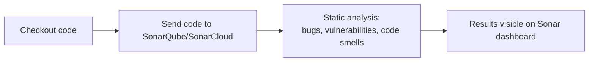

**Why it matters:** SAST finds issues like SQL injection risks, hardcoded credentials, or unsafe code patterns — all **before** the app is even built or run.

---

### 12. `dependency_scan.yml` — Software Composition Analysis (SCA)

**In plain words:** This app doesn't just run on code *we* wrote — it also relies on other people's code (libraries like Flask, Gunicorn, etc.). This workflow checks whether any of those third-party libraries have known security vulnerabilities.

- **Trigger:** `workflow_call` only.
- **What happens (job `dependency-scan`, run across Python 3.12 / 3.13 / 3.14):**
  1. Checkout code and set up Python.
  2. Run `pip-audit` — checks installed Python packages against a public vulnerability database.
  3. Run OWASP **Dependency-Check** — a second, more thorough scanner that fails the build if any dependency has a CVE (a publicly known vulnerability) with a severity score of 7 or higher (`--failOnCVSS 7`).
  4. Upload the generated HTML report as a downloadable artifact.

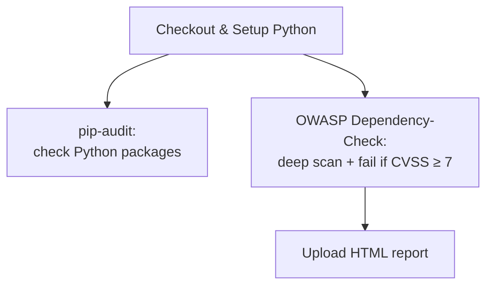

**Why it matters:** Most real-world breaches don't come from code teams wrote themselves — they come from outdated or vulnerable third-party libraries. This catches that risk before it ships.

---

### 13. `trivy_scans.yml` — Scan the Docker Image Itself

**In plain words:** Even if the *code* is clean, the Docker image is built on top of an operating system (here, `python:3.13-slim`) that has its own software and can have its own vulnerabilities. This workflow builds the image and scans **everything inside it** — OS packages and libraries — for known critical vulnerabilities.

- **Trigger:** `workflow_call` only.
- **What happens (job `trivy-scan`):**
  1. Checkout code, set up Docker + Buildx.
  2. Log in to Docker Hub.
  3. Build the Docker image (but don't push it yet — `push: false`).
  4. Run **Trivy** against that image, looking only at `CRITICAL` severity issues, ignoring ones with no available fix (`ignore-unfixed: true`), and **failing the workflow** (`exit-code: '1'`) if any are found.

```mermaid
flowchart LR
    A[Build Docker image\n(not pushed yet)] --> B[Trivy scans OS + libraries\ninside the image]
    B --> C{Any CRITICAL,\nfixable CVEs?}
    C -->|Yes| D[❌ Stop — don't push a vulnerable image]
    C -->|No| E[✅ Safe to push]
```

**Why it matters:** This is a checkpoint **right before shipping** — it stops a genuinely dangerous image from ever reaching Docker Hub or a server. Note: `.trivyignore` lists a few specific CVEs the team has consciously accepted as "won't fix right now" (tied to the base image version).

---

### 14. `docker_push.yml` — Push the Verified Image

**In plain words:** Once the image has passed the Trivy scan, this workflow builds it again and actually **pushes** it to Docker Hub, making it available to be pulled by the deploy step.

- **Trigger:** `workflow_call` only.
- **What happens (job `docker-push`):**
  1. Checkout code, set up Docker + Buildx.
  2. Log in to Docker Hub.
  3. Build **and push** (`push: true`) the image, tagged `<username>/e-commerce-python:latest`.

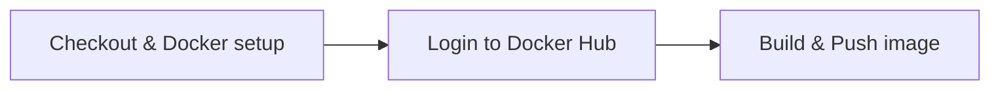

**Why it matters:** This is intentionally a *separate* step from the Trivy scan — the scan builds the image to inspect it, and only after it's approved does this workflow build it again and actually publish it.

---

### 15. `dast.yml` — Dynamic Application Security Testing (DAST)

**In plain words:** All the checks so far look at code or images *sitting still*. DAST is different — it waits until the app is **actually running live** on the server, then attacks it the way a real hacker's scanner would, checking for things like missing security headers, exposed error pages, or other runtime weaknesses.

- **Trigger:** `workflow_call` only.
- **What happens (job `dast`):**
  1. Checkout code.
  2. Wait (up to 60 seconds) for the live app to respond, by repeatedly pinging the server's address (`secrets.EC2_HOST`).
  3. Run an **OWASP ZAP baseline scan** against the live URL. It's configured to report findings without failing the pipeline (`fail_action: false`) — so it's currently informational rather than a hard gate.

```mermaid
flowchart LR
    A[Wait for the deployed app\nto respond] --> B[OWASP ZAP scans the\nLIVE running application]
    B --> C[Security report\n(non-blocking for now)]
```

**Why it matters:** This is "shift-right" — testing security in the real, running environment, which can catch issues that static code/image scans never would (like misconfigurations that only show up at runtime).

---

### 16. `devsecops_pipleline.yml` — The Full Pipeline (Puts Everything Together)

**In plain words:** This is the **conductor** of the whole orchestra. It doesn't do any scanning or building itself — instead, it calls every workflow above, **in the right order**, so that each stage only runs if the previous one succeeded. This is "shift-left, shift-right" in action: security checks start before the code is even built, and continue after it's deployed.

- **Trigger:** `push` — runs automatically every time someone pushes code to the repository.
- **The full chain (each step only runs if the one before it passes):**

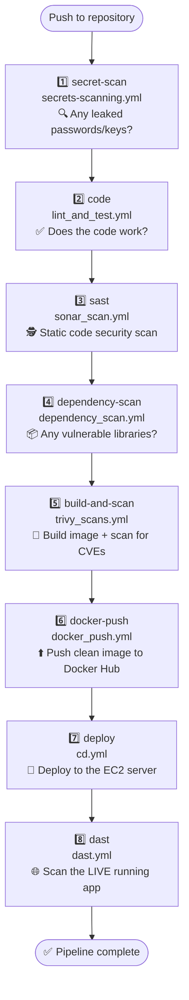

| Step | Stage | What it protects against |
|---|---|---|
| 1 | Secrets scan | Leaked passwords, API keys, tokens |
| 2 | Lint & test | Broken or badly-written code |
| 3 | SAST | Insecure coding patterns, bugs |
| 4 | Dependency scan | Vulnerable third-party libraries |
| 5 | Image build + scan | Vulnerable OS packages inside the container |
| 6 | Docker push | (Publishing step — no scan, just ships the verified image) |
| 7 | Deploy | (Delivery step — gets the app running) |
| 8 | DAST | Runtime/live security weaknesses |

**Why it matters:** Instead of security being "something the security team does at the end," it's spread across the *entire* lifecycle of the code — from the moment it's written to after it's live in production. This is the modern DevSecOps philosophy: **security is everyone's job, at every step.**

---

## 📖 Quick Glossary

| Term | Simple meaning |
|---|---|
| **Workflow** | One automation file (`*.yml`) — a recipe GitHub Actions follows. |
| **Job** | One "task" inside a workflow (e.g. "build the app"). A workflow can have several jobs. |
| **Step** | One single action inside a job (e.g. "checkout code", "run tests"). Jobs are made of steps. |
| **Trigger (`on:`)** | The event that starts a workflow — e.g. `push` (automatic, on every code push), `workflow_dispatch` (manual button click), `workflow_call` (called by another workflow, like a function call). |
| **`needs:`** | Tells a job to wait for another job to finish successfully first. |
| **Reusable workflow** | A workflow written with `on: workflow_call` so other workflows can "call" it instead of copy-pasting its steps. |
| **Secret** | A hidden, encrypted value (like a password) stored in GitHub settings — never shown in logs. |
| **Variable** | A shared, non-secret value stored in GitHub settings (like a username). |
| **Self-hosted runner** | A machine (here, an EC2 server) that *you* set up to run workflow jobs, instead of using GitHub's own cloud machines. Needed when a job must run directly on your server (e.g. to deploy). |
| **Matrix** | Running the same job multiple times with different settings (e.g. testing on Python 3.12, 3.13, and 3.14 in parallel). |
| **SAST** | Static Application Security Testing — scanning source code for security issues without running it. |
| **SCA** | Software Composition Analysis — checking third-party libraries/dependencies for known vulnerabilities. |
| **DAST** | Dynamic Application Security Testing — scanning a live, running application for security issues. |
| **CVE** | Common Vulnerabilities and Exposures — a publicly catalogued, known security flaw. |
| **CVSS** | Common Vulnerability Scoring System — a 0–10 score rating how severe a CVE is (higher = worse). |
| **Shift-left** | Catching problems as *early* as possible (e.g. scanning code before it's even built). |
| **Shift-right** | Continuing to check for problems *after* release (e.g. scanning the live running app). |

---

*This document is meant to be a living reference — as workflows change, keep this explanation in sync so it stays useful for newcomers.*
